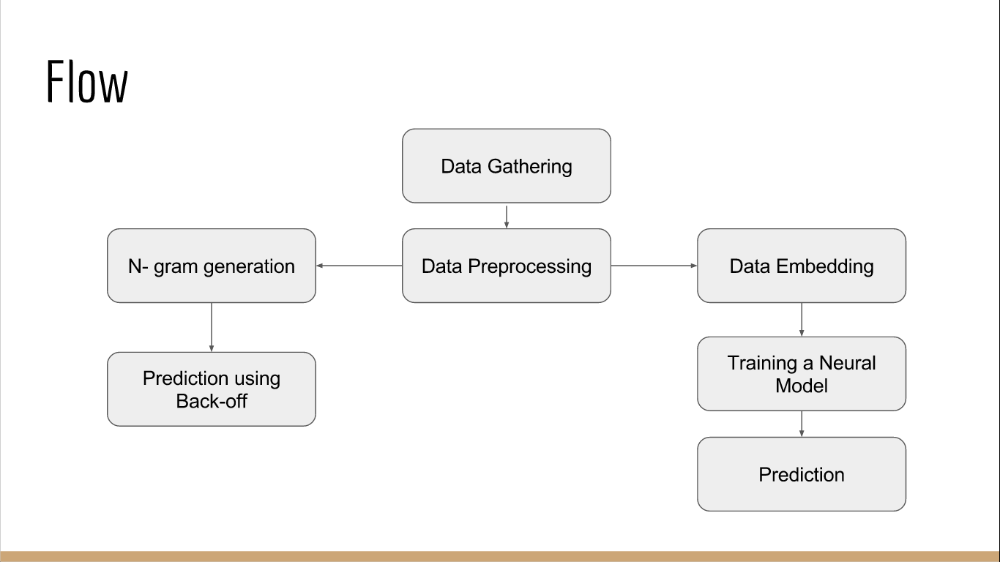

# Autofill

A model to suggest the next word(s) within a **closed domain** from a given set of words entered by the user. With the help of this bot or app we can constrain the user's questions to our knowledge domain and hence **avoid ambiguity** in finding answer it will also help to **reduce the user’s keystroke time** and will also **improve the typing accuracy**.
****
## Flow

 ### Data Gathering: ###
 
`./src/load_from_wiki.py`

 This script is used to download data from wikipedia. We can select topics of our choice.

 Here we have included 48 topics which are used in SQuAD dataset, on running this script it will store the text into *./data/wiki_data.json* file.

 `./src/load_squad_wiki_data.py`

 This script is to download data form SQuAD website ( https://rajpurkar.github.io/SQuAD-explorer/explore/1.1/dev/ ) and will also merge the wikipedia data from *./data/wiki_data.json* and store the whole data into *./data/squad_wiki_data.json* file.

 ### Data Pre-Processing: ###

 `./src/embeddings.py`

 Machine learning algorithms learn from data. It is critical that you feed them the right data for the problem you want to solve. Even if you have good data, you need to make sure that it is in a useful scale, format and even that meaningful features are included.

 In this file we will prepare data for our model. We will fetch **NEs** from our data using Spacy and will replce by a single word ( ex: **New York to New_York, India Gate to India_Gate** ), *remove the special characters*, will tokenize our *text into sentences*, then *sentences into words*, then we will convert out words into vectors.

 **Word Embedding** turns text into numbers. This 8transformation* is necessary because many machine learning algorithms (including neural nets) require their input to be *vectors of continuous values*; they just won’t work on strings of plain text.
 So a natural language modelling technique like Word Embedding is used to map words or phrases from a vocabulary to a corresponding vector of real numbers.

 This file will generate following files:
  - `./data/word_embeddings_EMBEDDINGSIZE_WINDOWSIZE_MINCOUNT_WORKERS.npz` :  **EMBEDDINGSIZE** is the length of vector in which each word will be represented. script will check a few number of words  around current word before converting it into a vector so that similar words remains close in vector representation, this number of word is represented by **WINDOW**. We won't take words which appeared vary few times, this minimum count of frequency is represented by **MINCOUNT**. **WORKERS** is the size of words to be taken at once, larger number will increase the speed but will reduce the accuracy. This file will store vector representation of words.
  
  - `./data/word2vec_model_EMBEDDINGSIZE_WINDOWSIZE_MINCOUNT_WORKERS.pickle` : This file will be used to convert words into there corresponding vector

  - `./data/word_tokenized_sentence_EMBEDDINGSIZE_WINDOWSIZE_MINCOUNT_WORKERS.json` : This file contains word tokenized sentences. Will be further used for POS tags.

  - `./data/indexed_vocabulary_EMBEDDINGSIZE_WINDOWSIZE_MINCOUNT_WORKERS.json` : This file will contains all vocabulary with corresponding indices.

  - `./data/pos_categorical_indexed_sentences_EMBEDDINGSIZE_WINDOWSIZE_MINCOUNT_WORKERS` : It contains POS tags in categorical format.

  `./src/intersect_embeddings.py`

  Google provides a pre-trained word2vec model (   download here : https://drive.google.com/file/d/0B7XkCwpI5KDYNlNUTTlSS21pQmM ). So we will intersect our vocabulary with Google's. Its trained on larger data set so will provide better vectors.

  It will generate **./data/google_intersected_model_EMBEDDINGSIZE_WINDOWSIZE_MINCOUNT_WORKERS.json**, we will use this file for better results insted of above.

 ### Training a Neural Model:

   - `./data/Model_Template.py` : We use this file to create different variations of the model.

### TODO:

To improve the README.md

